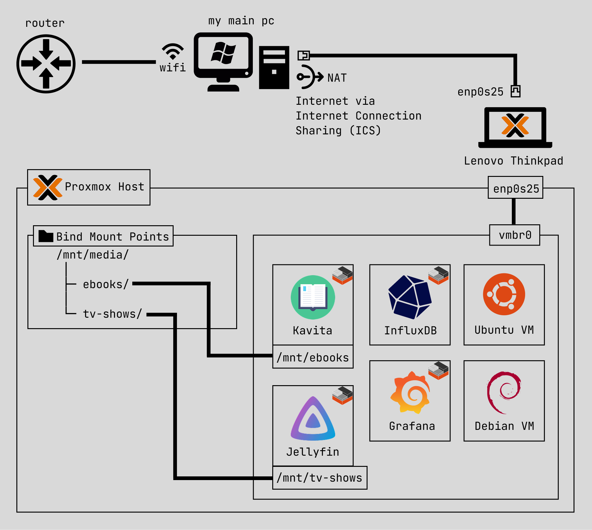
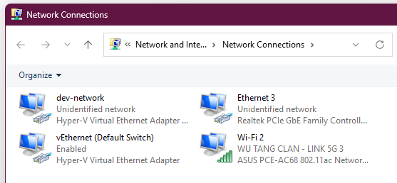
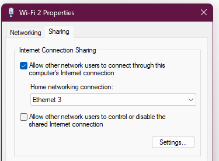
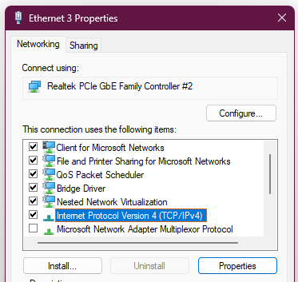
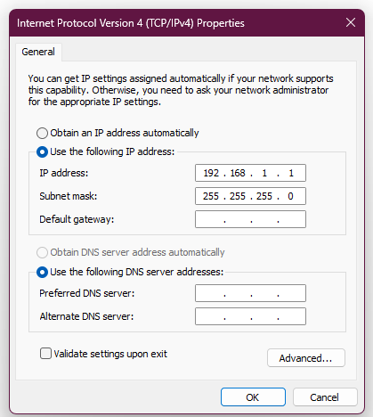

import { Image } from "astro:assets";

import homelabFrontview from "../../assets/homelab/homelab-1.jpg";
import homelabPc from "../../assets/homelab/homelab-2.jpg";

# My Homelab

I converted a Lenovo Thinkpad (that my sister got for free from her previous workplace) into a Proxmox server.

I mainly use it to store/read my eBooks, host & preserve 🏳️‍🌈 chinese TV shows (some unfortunately banned in China :c), learn networking, and test scripts in sandbox/ephemeral environments.

pics of my crappy homelab 🫠

<div class="flex flex-wrap gap-6">
  <Image
    class="border-1 size-fit w-[330px] !m-0"
    src={homelabFrontview}
    alt="homelab-frontview"
    width={330}
    height={330}
  />
  <Image
    class="border-1 size-fit w-[330px] !m-0"
    src={homelabPc}
    alt="homelab-with-pc"
    width={330}
    height={330}
  />
</div>

---

## Diagram



<figcaption>
  *as i'm expanding my homelab (network switch coming soon), i'll update the
  diagram but keep previous iterations up here.
</figcaption>

On the top, I have my main Windows PC workstation where I initially started with Hyper-V.

Then I installed Proxmox VE on a Lenovo Thinkpad since I wanted to try out Proxmox for fun and also offload some work off my main PC.

---

## Network

### Setting up Internet Connection

First issue I ran into was getting my PVE server to reach the internet.

Since the router is on the opposite side of the building and I didn't have a long enough ethernet cable, I ended up having my main PC act as the "router" by using windows Internet Connection Sharing (ICS).

The ethernet interface on my PC has ICS setup, which is then connected by an eth cable to my laptop.
Internet traffic to my PVE server essentially goes through NAT twice: one on the actual router and one on my main PC through ICS.

### How to setup ICS

Steps for dummies (like me) on setting up ICS for internet connection for your PVE server.

1. Navigate to `Control Panel` > `Network and Internet` > `Network Connections`.



Here you'll see all your host's networking stuff.

One should be the ethernet interface that'll be connecting to your PVE server, and another should be the wifi adapter on your host that is connected to the actual router.

For me, the eth interface is `Ethernet 3` and the wifi adapter is `Wi-Fi 2`.

2. Right Click on the wifi adapter (`Wi-Fi 2` for me) and open `Properties`, then navigate to the `Sharing` tab.



Check the box for `Allow other network users to connect through this computer's Internet connection`.
Then in the `Home networking connection:` dropdown, select the eth interface that you'll be using (`Ethernet 3` for me).

When clicking `OK`, you may get a pop-up about the IP automatically being assigned to the eth interface, ignore that since we'll need to manually assign our own.

3. Right Click on the eth interface (`Ethernet 3` for me) and open `Properties`, then under `Networking` tab, select `Internet Protocol Version 4 (TCP/IPv4)`, then select `Properties`.



4. Select the radio option `Use the following IP address`.

For this, you'll need to input the gateway IP (and mask if it's different) that you configured on your PVE server.



For me, it's `192.168.1.1`, which can be found in `/etc/network/interfaces`:

```bash
root@pve01:~# cat /etc/network/interfaces
<...>
iface vmbr0 inet static
        address 192.168.1.2/24
        gateway 192.168.1.1
        bridge-ports enp0s25
        bridge-stp off
        bridge-fd 0
<...>
```

Click OK for the rest, now it is done! \\o/

You can give a `ping` test to check if you can reach the PVE server locally.

### Caveats in my network setup

Since it's not connected to my actual router, the services don't get DHCP, meaning I have to manually set a static IP for every one of them (which i track in a notepad :P).

export const url =
  "https://www.reddit.com/r/truenas/comments/ugavqe/ok_whose_bright_idea_was_to_label_ip_addresses";

This can be a pain for some services, like TrueNAS >.> <a class="wrap-break-word" href={url}>{url}</a>

It's a janky setup, but it works ¯\\\_(ツ)\_/¯. The laptop technically has a wifi adapter built in, but setting up WLAN seems to be [strongly discouraged](https://pve.proxmox.com/wiki/WLAN).

---

## Storage

My laptop only has a single SSD which is using `ext4`, and since I didn't want to wear out the disk too fast, I disabled HA/auto-backups.
All my media is instead manually backed up on my main PC.

As you can see in the diagram, I'm hosting [Kavita](https://github.com/Kareadita/Kavita) and [Jellyfin](https://github.com/jellyfin/jellyfin), in which all the media is stored under `/mnt/media` on the PVE host.
The LXC containers have access to the directories through [Bind Mount Points](https://pve.proxmox.com/wiki/Linux_Container#_bind_mount_points).

Since the containers are unprivileged, they cannot write to the directory (which I'm working to change in the future or at least have better setup), so I transfer data with `scp` from my main PC.

I've thought about using [TrueNAS](https://github.com/truenas) along with a mounted flash drive to manage my media storage, however, this flash drive is what I use to install Proxmox and is the only one I have. :/

---

## Power

Since this is a laptop, it's definitely not good to have it constantly charged 24/7, so I really only charge it when the battery low or when it's off.

I'm also not running any services that require 100% uptime, so I shutdown the server like I do with my main PC.

I've also configured the laptop to turn off screen after 30 sec of inactivity, and to keep running when lid is closed.
Guide I used: https://www.youtube.com/watch?v=_u8qTN3cCnQ&t=1588s

---

## Final Thoughts

Note I am faaaar from an expert on these sort of things, and I'm mainly just doing this for fun and to learn something cool.
There's a lot of experts and documentation online that I constantly refer to make this work, and will try to link every one that I use.

Since I'm only using my services locally from my main PC, this entire setup is good enough for now (although will definitely change once I get my own place and expand my homelab).

### Hyper-V vs Proxmox

Overall, Hyper-V and Proxmox both work and I'm not running any insane usecases that require some optimal setup.

- #### What I like about Hyper-V

  Hyper-V Manager GUI is cleaner and is more intuitive to use if you're completely new.

  Simple things like setting up a virtual switch, checkpoints (snapshot equivalent for Proxmox), and manual backups are very easy to do.

- #### What I like about Proxmox

  I've found that spinning up ephemeral VMs is definitely a lot faster on Proxmox than on Hyper-V.

  LXC containers are also extremely convenient for hosting single services.

  There's also a lot more community resources/guides/docs online (like [PVE Helper Scripts](https://community-scripts.github.io/ProxmoxVE)) than Hyper-V.
  I found that there wasn't much guides or blogs from the community for Hyper-V. Most of their support appears to come from being enterprise customers.

From what I've researched, a big feature of Proxmox over Hyper-V is ZFS, which I'm currently not using. I'm not concerned with data integrity so I'm using `ext4`.

### Future Todos

- automate entire setup with Terraform and/or Ansible.
  all the configuration of the PVE environment and services were done manually.
  would make migration to a better setup so much easier.

- setup a DNS server on proxmox that my main PC can refer to so that i'm not using the raw IPs.

- setup pfSense/OPNsense and Pi-hole. will need to reconfigure the networking.

- add a current battery power status to GUI.

- create a dashboard.

- enable periodic backups once i get a proper server and/or some NAS machine.
