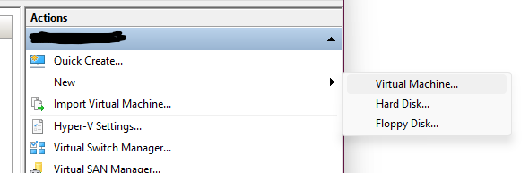
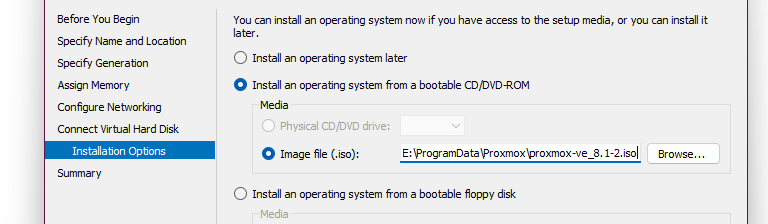
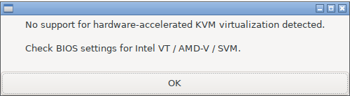
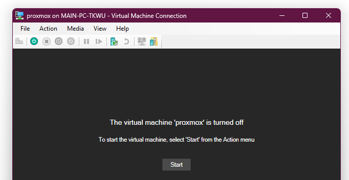
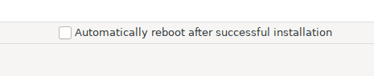
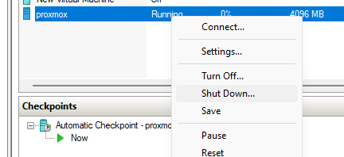
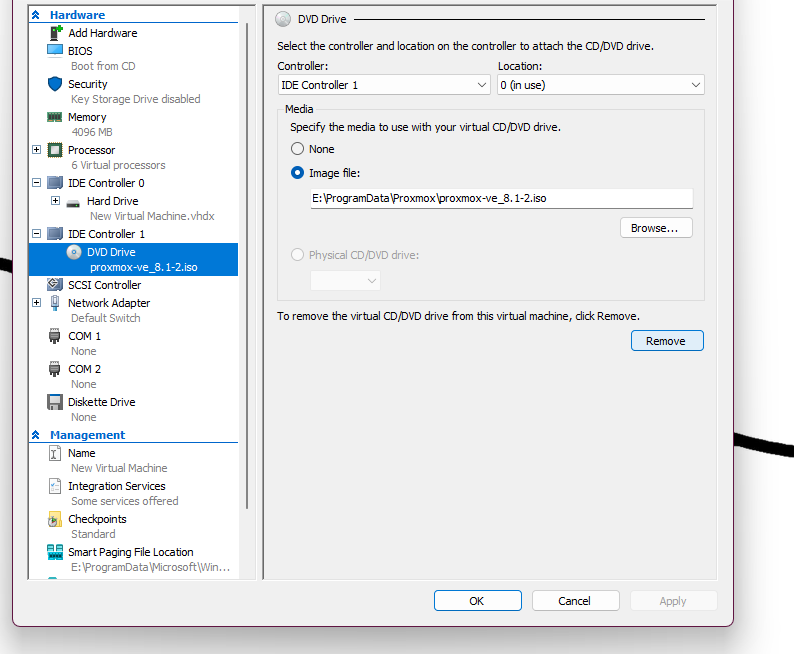
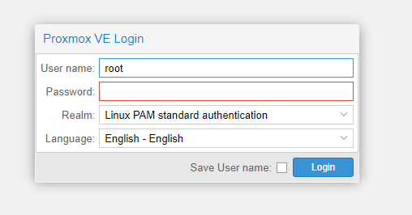

<!-- # Installing Proxmox VE on Hyper-V -->

Here are instructions for installing Proxmox on Hyper-V. If you don't have a homelab setup and want to play with proxmox, then this _should_ be good enough sandbox environment for you. 🙃

You will definitely encounter some quirks. I originally wrote this a while back, so I don't quite recall what additional configurations I used to get this working (or at least not broken :P).

## Prerequisite

- Have Windows [nested virtualization](https://learn.microsoft.com/en-us/virtualization/hyper-v-on-windows/user-guide/enable-nested-virtualization) feature (I had to upgrade to Windows 11 for this).
- Enable [virtualization](https://support.microsoft.com/en-us/windows/enable-virtualization-on-windows-11-pcs-c5578302-6e43-4b4b-a449-8ced115f58e1).

## Install Steps

1. Download the [Proxmox VE ISO](https://www.proxmox.com/en/downloads).

2. Open Hyper-V Manager, and select `New` > `Virtual Machine` on the right panel.



3. Configure the VM as you like (name, memory, storage, etc.), but make sure that `Generation 1` is selected.

For the network configuration, I chose `Default Switch`.

Under `Connect Virtual Hard Disk` > `Installation Options`, select `Install an operating system from a bootable CD/DVD-ROM` > `Image file (.iso)` and choose the ISO that you downloaded from part 1.



Finally, select `Finish` to create the VM.

4. Next is enabling nested virtualization on the VM. Open Powershell with Admin privileges, and execute:

```bash
Set-VMProcessor -VMName $VmName -ExposeVirtualizationExtensions $true
```

If you do not enable nested virtualization, you will be met with this pop-up when starting the VM.



5. To start/boot the VM, select it under the `Virtual Machines` tab in Hyper-V Manager, then select `Connect` > `Start`.



6. Select `Install Proxmox VE (Graphical)`, and it should now take you through the installation setup. Note, you can only use the `arrow keys` for navigation, `enter` to select, and `esc` to go back.

7. Finally on the Summary window, uncheck `Automatically reboot after successful installation` (since we need to remove the ISO before we reboot), and select `Install`.



8. After it finishes installing, it should display `Installation successful!` along with `Next steps`. Instead of immediately rebooting, we must first remove the ISO or else rebooting will take us back to the installation setup again.

To do this, first `Shut Down` (or `Turn Off`) the VM in Hyper-V Manager.



Open `Settings` for the VM on the lower right panel. Then select the `DVD Drive` that contains the proxmox ISO, and `Remove`.



Select `Apply` > `Okay` to finish.

9. Now start the VM, and you should be shown this window. Open the outputted URL (i covered in pink) in your preferred web browser.


Enter your login credentials that you configured from part 6. The `User name` is defaulted to `root`.



Congrats, you now have Proxmox installed on Hyper-V and the web dashboard up and running!!! ᕙ(^▿^-ᕙ)

---

IIRC, you'll need to enable [MAC address spoofing](https://learn.microsoft.com/en-us/answers/questions/1075755/enable-mac-address-spoofing) in order for your containers to correctly receive traffic from public (but i might be wrong since it's been a while).
