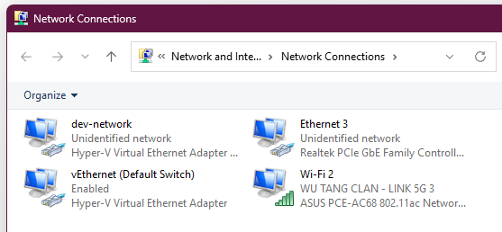
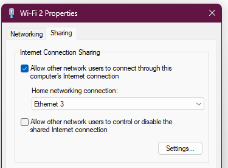
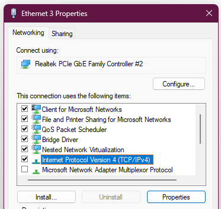
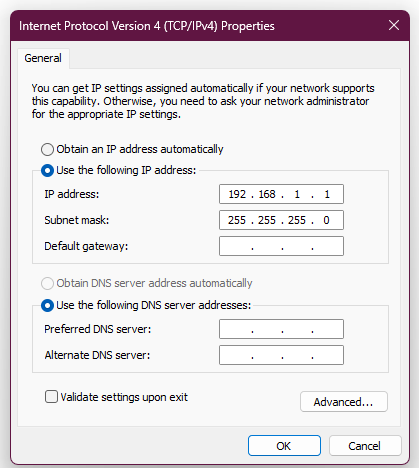

When setting up the PVE network, you'll need some way to connect your server to your router.
You have 2 options:

- wired via ethernet cable
- wireless however this is [strongly discouraged](https://pve.proxmox.com/wiki/WLAN)

This simple guide will go over a way to achieve a "wired" setup for PVE, but connect to the router
via wifi through Windows Internet Connection Sharing (ICS).

This was my setup when first creating my homelab because I didn't have a long enough ethernet cable
to connect my PVE server to the router.
This can also be used in situations where the router isn't accessible, like a dorm.

**TL;DR** -- enable ICS from wifi interface to ethernet interface, then assign static IP to eth
interface that is same IP of your PVE's default gateway.

## Prerequisite

- a Windows machine 😱
- an ethernet cable that can at least connect your PVE server to your Windows machine
- and [this](https://www.youtube.com/watch?v=dQw4w9WgXcQ)

## Configuring ICS on an interface

1. Navigate to `Control Panel` > `Network and Internet` > `Network Connections`.



Here you'll see all your host's network interfaces (both physical & virtual).

One should be the physical ethernet interface that's connected to your PVE server, and another
should be the wifi adapter on your host that is connected to the actual router.

For me, the eth interface is `Ethernet 3` and the wifi adapter is `Wi-Fi 2`.

2. Right Click on the wifi adapter (`Wi-Fi 2` for me) and open `Properties`, then navigate to the
   `Sharing` tab.



Check the box for `Allow other network users to connect through this computer's Internet connection`.
Then in the `Home networking connection:` dropdown, select the eth interface that you'll be using
(`Ethernet 3` for me).

When clicking `OK`, you may get a pop-up about the IP automatically being assigned to the eth
interface, ignore that since we'll need to manually assign our own.

3. Right Click on the eth interface (`Ethernet 3` for me) and open `Properties`, then under
   `Networking` tab, select `Internet Protocol Version 4 (TCP/IPv4)`, then select `Properties`.



4. Select the radio option `Use the following IP address`.

Input the default gateway IP (and mask if it's different) that you configured on your PVE server.



I modified mine to be the first address on the subnet `192.168.1.1`.

This can be found/edited in `/etc/network/interfaces`:

```bash
root@pve01:~# cat /etc/network/interfaces
<...>
iface vmbr0 inet static
        address 192.168.1.2/24
        gateway 192.168.1.1
        bridge-ports enp0s25
        bridge-stp off
        bridge-fd 0
<...>
```

Click OK for the rest, now it is done! \\o/

You can give a `ping` test from the PVE host to verify that it can reach the internet.
Your PVE host should also be accessible from your Windows machine via LAN as well.

<br />

### Caveats in this network setup

Since the PVE server is not connected to an actual router, your hosted services will not get DHCP,
meaning you'll have to manually assign static IPs every time you create a VM/LXC.

This can be a pain for some services, like TrueNAS >.>

<blockquote class="wrap-break-word">
Ok, whose bright idea was to label IP Addresses "Aliases" in the setting?
<a href="https://www.reddit.com/r/truenas/comments/ugavqe/ok_whose_bright_idea_was_to_label_ip_addresses">
https://www.reddit.com/r/truenas/comments/ugavqe/ok_whose_bright_idea_was_to_label_ip_addresses
</a>
</blockquote>
