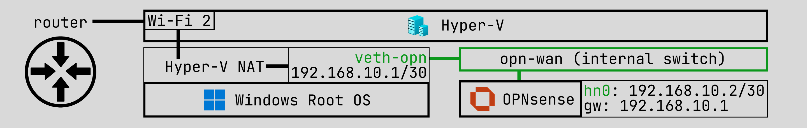
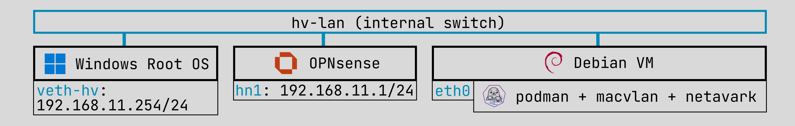
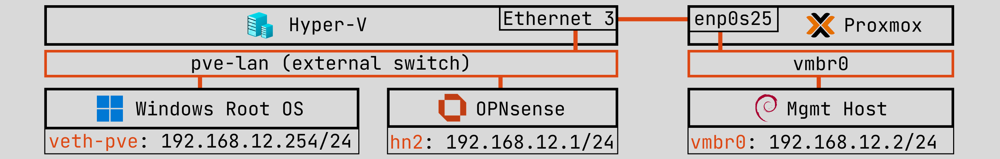

<section id="network" class="scroll-anchor-offset">

# Network

My homelab network contains 3 subnets managed by OPNsense:
- `192.168.10.0/30`: OPNsense `WAN`
- `192.168.11.0/24`: Hyper-V `LAN`
- `192.168.12.0/24`: PVE `LAN`

<section id="opnsense-setup" class="scroll-anchor-offset">

## OPNsense Setup

#### Connection to router

Typically the OPNsense `WAN` interface connects to the router via wire.
But since my PC only has 1 NIC, which is already connected to my laptop (plus I've only got 1 eth
cable), I had to get creative.

I did a similar trick from my previous setup to facilitate a "wired" connection to the router.
I created an **internal** switch (`opn-wan`) that connects only the OPNsense VM and my Win mgmt
host, so OPNsense can "connect" to the router through the mgmt host.

Hyper-V NAT is applied on the `opn-wan` subnet (`192.168.10.0/30`), so that anything outside
OPNsense's network gets forwarded from OPNsense's gateway -> Win mgmt host -> mgmt host's wifi
interface -> router.

I also found that ICS configured on any of the Win mgmt host's interfaces gave access to the wifi
adapter, but it was a bit flaky on reboots.
I sometimes had to manually re-configure ICS again on start up.

#### DHCP & DNS

I'm using `Dnsmasq` for DHCP and `Unbound DNS` for DNS.

I've setup DHCP reservations for some hosts (like PVE) so they get static IPs, and more
importantly, have their hostnames automatically registered in DNS.

I'm able to resolve all the local hostnames in my lab network -- just not on my Win mgmt host. :c

As it turns out, [Windows only switches DNS servers if the primary is unresponsive](https://www.reddit.com/r/sysadmin/comments/11tm4t0/host_doesnt_use_secondary_dns_but_direct_nslookup).
A responses like "cannot find" or "no such host" are technically valid responses, so Windows does
does not try the secondary DNS.

I tried pointing my Win mgmt host to OPNsense as its primary, thinking OPNsense would just
forward queries to the router, but that backfired.
It ended up looping from Win host -> OPNsense -> Win host -> OPNsense -> ..., due to the caveat I
mentioned earlier.

Final note, bc my Win host was getting DHCP from both the router and OPNsense, I ended up with 2
default gateways.
I had to manually lower the metric on the wifi adapter so Windows would prioritize the router's
gateway instead of OPNsense (otherwise it would fallback to the same looping issue).

</section> {/* opnsense-setup */}

 

<section id="hyper-v-network" class="scroll-anchor-offset">

## Hyper-V Network

The Hyper-V network is on an **internal** switch called `hv-lan`, which is managed by OPNsense on
`hn1`.

By default, OPNsense's firewall blocks inbound on the `WAN` interface, which is fine.
I instead access all my services on Hyper-V from `hv-lan`.

#### Container apps

Similar to how LXCs on Proxmox have their own IP that's visible on the L2 network, I wanted my
container apps on Hyper-V to have their own IP.

A Debian VM with docker + macvlan worked great, but I also wanted OPNsense to be aware of these
containers for auto hostname registration and avoid IP conflicts with docker's own assignments.

I first found this [docker network driver](https://github.com/devplayer0/docker-net-dhcp) that
seemed promising for my usecase? but it hasn't been updated in a long time.
Then I found podman supported DHCP leasing with macvlan via [netavark](https://docs.redhat.com/en/documentation/red_hat_enterprise_linux/9/html/building_running_and_managing_containers/assembly_setting-container-network-modes_building-running-and-managing-containers#running-the-dhcp-plugin-for-netavark-using-systemd_assembly_setting-container-network-modes),
so I moved to podman.

Unfortunately, macvlan (in both docker & podman) doesn't support port mapping, so I can't expose
web services to port 80 for convenient access.
Also containers on macvlan can't reach the host, which is why I have [Glances](https://github.com/nicolargo/glances)
as another container on the same macvlan network.

I still keep docker for testing/trying out apps that I may want to keep.
If I decide to keep them, I host them on podman.

</section> {/* hyper-v-network */}

 

<section id="pve-network" class="scroll-anchor-offset">

## PVE Network

The PVE network is on `vmbr0`, which is connected to a Hyper-V **external** switch called `pve-lan`
which is managed by OPNsense on `hn2`.

The **external** switch lets my PC's physical interface `Ethernet 3` to participate in Hyper-V's
virtual network, which is connected via eth cable to my PVE laptop.

Even though I can access the PVE web UI from my Win mgmt host from the `hv-lan` network, this only
works if my Win host's gateway is set to OPNsense, which breaks access to the router bc of the
looping issue I mentioned earlier.

So I instead connect my Win host to `pve-lan` to access all my PVE stuff.

</section> {/* pve-network */}

</section> {/* network */}

overall it's a janky setup, but it works for me ¯\\\_(ツ)\_/¯
